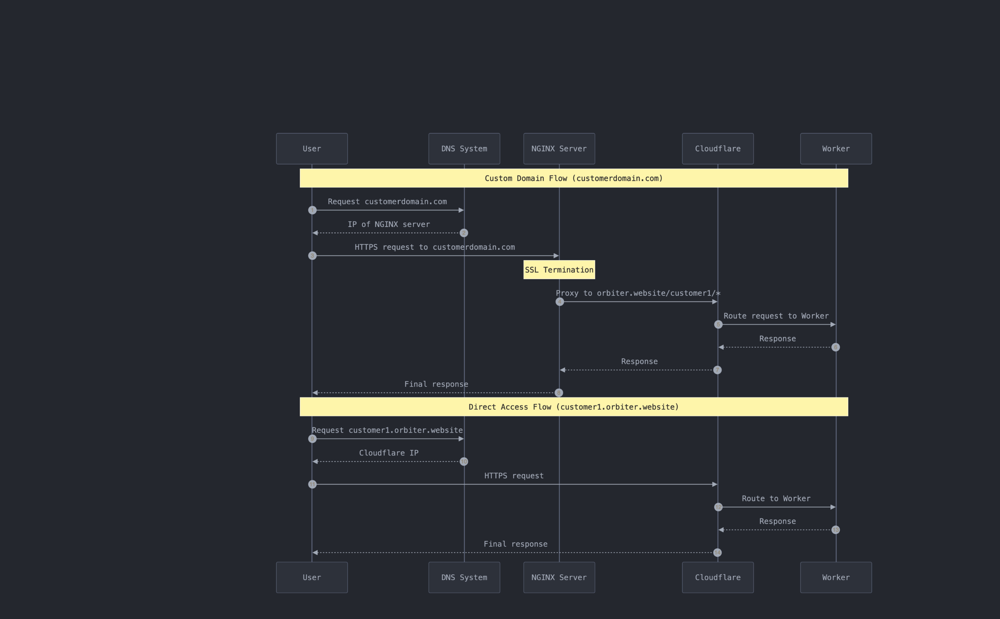

# Orbiter NGINX Custom Domain Server

This server has two jobs: 
1. To create NGINX config files for customer custom domains
2. To proxy requests from NGINX to the Cloudflare worker that will render the customer's site

## Details



The server runs on Digital Ocean. A simple express server with admin route protection is called from the Orbiter backend API to generate custom domains and SSL records.

The admin token is stored as an .env and the request to this server must use that token as a Bearer token in the request. 

## Manual Access

You can manually access the Digital Ocean droplet via SSH. Once SSH'd in, you can check on site configs manually by running: 

```
cat /etc/nginx/sites-available/${customer_custom_domain} // orbiter.host for example
```

You can list all the sites with custom domains by running: 

```
ls /etc/nginx/sites-available/
```